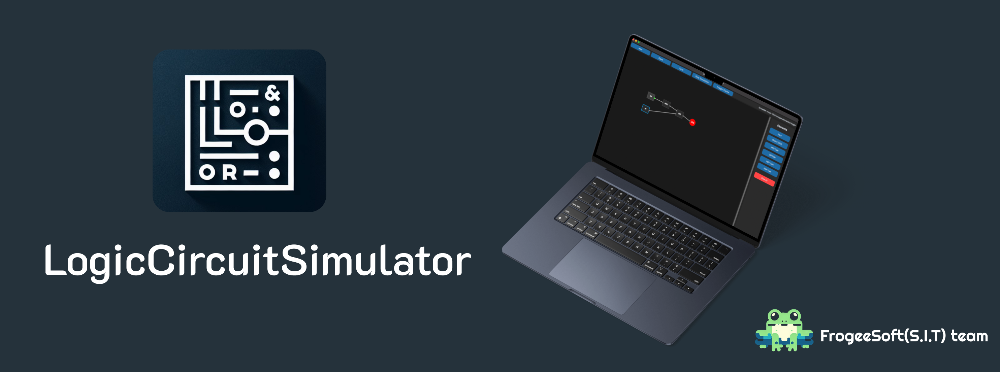

# Logic Circuit Simulator
[EN README](README.md) | [RU README](READMERU.md)

A powerful and intuitive graphical logic circuit simulator built with Python and Tkinter. This application allows users to design, simulate, and test digital logic circuits in a user-friendly environment.



## Features

- 🎯 **Intuitive Interface**: Drag-and-drop interface for easy circuit design
- 🔌 **Basic Logic Gates**: Support for AND, OR, NOT, and XOR gates
- 💡 **Input/Output Devices**: Interactive input buttons and LED outputs
- 🔄 **Real-time Simulation**: Test your circuits instantly
- 📝 **Save/Load**: Save your circuit designs and load them later
- 🎨 **Visual Feedback**: Color-coded signals and interactive elements
- 🖱️ **Easy Connections**: Simple click-to-connect interface
- 🗑️ **Clean Design**: Delete elements and connections with ease

## Installation

1. Clone the repository:
```bash
git clone https://github.com/arduradiokot/LogicCircuitSimulator.git
cd LogicCircuitSimulator
```

2. Make sure you have Python 3.x installed on your system.

3. Install the required dependencies:
```bash
pip install tkinter
```
 **Or just download the release version as an app ;)**

## Usage

1. Run the simulator:
```bash
python src/LogicCircuitSimulator.py
```

2. **Creating Elements**:
   - Use the sidebar buttons to add logic gates and I/O devices
   - Drag elements to position them on the canvas

3. **Making Connections**:
   - Click on an output port (gray circle)
   - Click on an input port to create a connection
   - Right-click on connections to delete them

4. **Simulation**:
   - Click "Start Simulation" to begin testing
   - Click on input elements to toggle their state
   - Watch the LED outputs change in real-time

5. **Saving/Loading**:
   - Use the toolbar buttons to save or load circuit designs
   - Files are saved in `.lcs` format

## Controls

- **Left Click**: Select elements, create connections
- **Right Click**: Delete connections
- **Delete Key**: Remove selected element
- **Drag**: Move elements around the canvas

## Project Structure

```
LogicCircuitSimulator/
├── src/
│   └── logic_circuit.py    # Main application code
├── README.md              # This file
└── requirements.txt       # Project dependencies
```

## Contributing

Contributions are welcome! Please feel free to submit a Pull Request.

## License

This project is licensed under the GPL-2.0 - see the LICENSE file for details.

