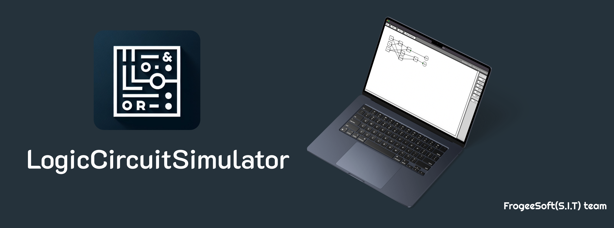

# Симулятор Логических Схем
[EN README](README.md) | [RU README](READMERU.md)

Мощный и интуитивно понятный графический симулятор логических схем, созданный на Python с использованием Tkinter. Это приложение позволяет пользователям проектировать, симулировать и тестировать цифровые логические схемы в удобной среде.



## Возможности

- 🎯 **Интуитивный Интерфейс**: Интерфейс с перетаскиванием для легкого проектирования схем
- 🔌 **Базовые Логические Элементы**: Поддержка элементов И, ИЛИ, НЕ и исключающее ИЛИ
- 💡 **Устройства Ввода/Вывода**: Интерактивные кнопки ввода и светодиоды выходы
- 🔄 **Симуляция в Реальном Времени**: Тестируйте ваши схемы мгновенно
- 📝 **Сохранение/Загрузка**: Сохраняйте ваши проекты схем и загружайте их позже
- 🎨 **Визуальная Обратная Связь**: Цветовая индикация сигналов и интерактивные элементы
- 🖱️ **Простое Соединение**: Простой интерфейс соединения по клику
- 🗑️ **Чистый Дизайн**: Легкое удаление элементов и соединений

## Установка

1. Клонируйте репозиторий:
```bash
git clone https://github.com/arduradiokot/LogicCircuitSimulator.git
cd LogicCircuitSimulator
```

2. Убедитесь, что у вас установлен Python 3.x на вашей системе.

3. Установите необходимые зависимости:
```bash
pip install tkinter
```
 **Или просто скачайте версию приложения из релиза ;)**

## Использование

1. Запустите симулятор:
```bash
python src/LogicCircuitSimulator.py
```

2. **Создание Элементов**:
   - Используйте кнопки боковой панели для добавления логических элементов и устройств ввода/вывода
   - Перетаскивайте элементы для их размещения на холсте

3. **Создание Соединений**:
   - Кликните на выходной порт (серый круг)
   - Кликните на входной порт для создания соединения
   - Правый клик на соединениях для их удаления

4. **Симуляция**:
   - Нажмите "Начать Симуляцию" для начала тестирования
   - Кликайте на элементы ввода для изменения их состояния
   - Следите за изменениями светодиодных выходов в реальном времени

5. **Сохранение/Загрузка**:
   - Используйте кнопки панели инструментов для сохранения или загрузки проектов схем
   - Файлы сохраняются в формате `.lcs`

## Управление

- **Левый Клик**: Выбор элементов, создание соединений
- **Правый Клик**: Удаление соединений
- **Клавиша Delete**: Удаление выбранного элемента
- **Перетаскивание**: Перемещение элементов по холсту

## Структура Проекта

```
LogicCircuitSimulator/
├── src/
│   └── logic_circuit.py    # Основной код приложения
├── README.md              # Этот файл
└── requirements.txt       # Зависимости проекта
```

## Участие в Разработке

Мы приветствуем ваш вклад! Не стесняйтесь отправлять Pull Request.

## Лицензия

Этот проект распространяется под лицензией GPL-2.0 - подробности в файле LICENSE.

